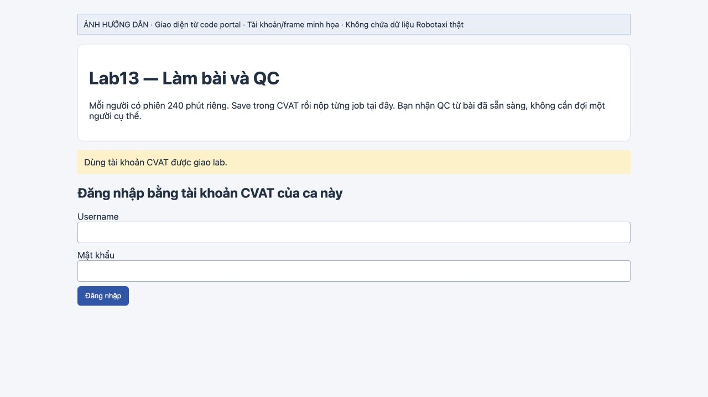
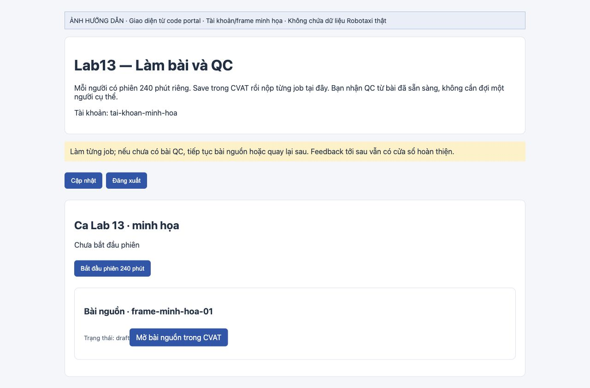
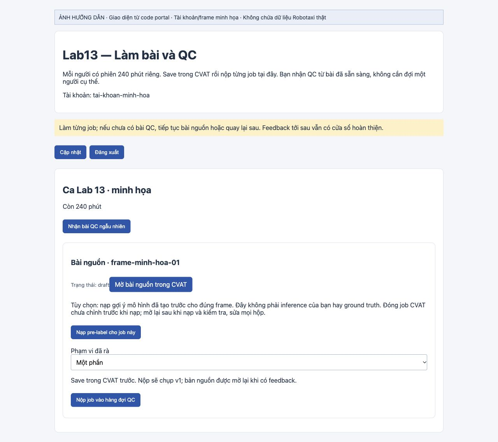
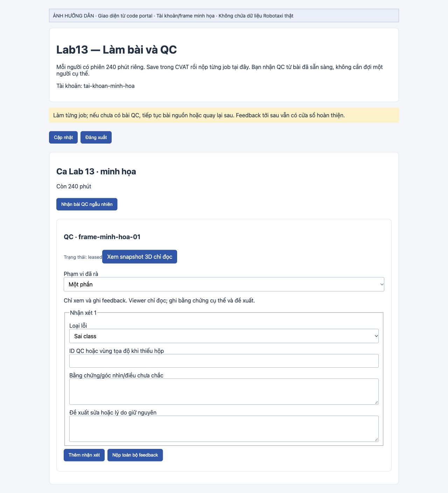
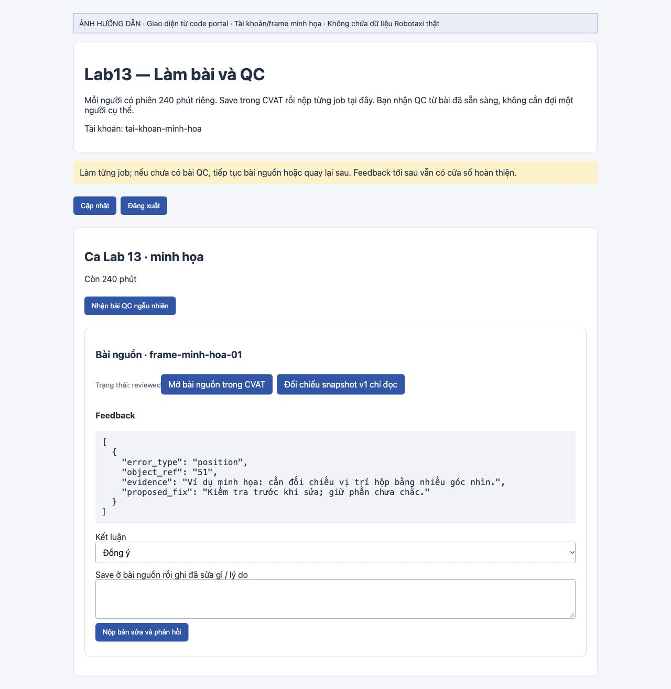

# Hướng dẫn có hình — Nạp pre-label → chỉnh CVAT → QC → sửa v2

Dành cho học viên và LC được giao bài trên **CVAT chương trình**.

> Các hình chụp giao diện được render từ code portal, với tài khoản/frame minh họa. Không chứa PCD, ảnh camera, annotation Robotaxi thật hoặc điểm riêng. Job ID trong hình là minh họa; mở bài của bạn bằng liên kết trên portal.

## 1. Đăng nhập đúng portal

Mở [portal chương trình](https://precious-opera-rarely-essays.trycloudflare.com/lab13-program/) và đăng nhập bằng **tài khoản CVAT chương trình được giao lab**. CVAT ở [cvat.note.transformerlabs.ai](https://cvat.note.transformerlabs.ai/). Hai trang phải dùng cùng tài khoản. Link Cloudflare có thể đổi khi tunnel khởi động lại; dùng link mới nhất LC gửi nếu link này không mở được.

**Kiểm tra:** portal hiện đúng username và ca của bạn. Không dùng tài khoản pilot LC hoặc tài khoản của người khác.

## 2. Bắt đầu phiên và làm A/B/C theo nhóm

Bấm **Bắt đầu phiên 240 phút** khi bắt đầu phần PointPillars. Mỗi người có đồng hồ riêng, không phải mốc giờ chung của lớp.

Nhóm 3–4 người tự chạy A/B/C trên một máy theo [PRE-LABEL.md](PRE-LABEL.md), dùng **gói Student KITTI**. So A/B để kiểm dịch z, B/C để kiểm pillar; ghi báo cáo private và nhờ LC kiểm trước khi làm nguồn. Nhóm không chạy được dùng máy LC phòng theo lượt.

| Bước | Đầu vào và nơi chạy | Kết quả dùng ở đâu? |
| --- | --- | --- |
| Thí nghiệm A/B/C | KITTI trong gói Student; Docker CPU máy nhóm/máy LC | Đọc Side, JSON, CSV và viết báo cáo nhóm |
| Nạp pre-label trên portal | Prediction Robotaxi đúng frame do LC chạy trước | Nạp vào job nguồn trống của chính bạn để chỉnh |

**Không import JSON KITTI hoặc các ca `training_only` vào job Robotaxi.** Nút portal không chạy model trên máy bạn và không thay thế bằng chứng tự chạy A/B/C. Prediction cũng không phải ground truth/reference.

## 3. Nạp pre-label vào job nguồn trống

Ở thẻ **Bài nguồn** của bạn, trạng thái `draft`:

1. Nếu đã mở CVAT nhưng chưa chỉnh gì, **đóng tab job đó trước khi nạp**. Nếu có thay đổi chưa Save, giữ lại công việc và báo LC; không bỏ sửa đổi để ép job thành trống.
2. Bấm **Nạp pre-label cho job này** một lần. Đợi thông báo kết quả; không bấm liên tục.
3. Khi portal báo **Đã nạp … gợi ý**, bấm **Mở bài nguồn trong CVAT** để mở lại dữ liệu mới.

**Kiểm tra:** đúng job/frame, hộp prediction đã xuất hiện trong CVAT. Số hộp tùy frame; không cần bằng số trong ví dụ hoặc bằng nhóm khác.

Hệ thống chỉ cho nạp vào bài nguồn **trống**, đúng người được giao, còn `draft`, trong phiên đã bắt đầu và chưa hết hạn. Hệ thống kiểm frame/schema trước khi nạp và từ chối bài đã có annotation hoặc đã nộp. Job mới mở trống là bình thường: pre-label không tự nạp cho tất cả mọi người.

## 4. Chỉnh cuboid và nộp v1

Trong CVAT, kiểm PCD và ảnh camera cùng frame theo [LABEL_GUIDELINE.md](LABEL_GUIDELINE.md): class, tâm, kích thước, hướng, hộp thiếu và hộp thừa. Kiểm nhiều góc nhìn; đừng giữ hộp chỉ vì model đã vẽ. Nếu cả batch lệch, báo LC kiểm pipeline trước khi sửa từng hộp.

1. Chỉnh bài rồi bấm **Save trong CVAT**; đợi lưu xong.
2. Trở lại portal, chọn **Phạm vi đã rà** đúng thực tế. Chỉ chọn **Toàn frame, gồm hộp thiếu/thừa** khi đã rà cả frame.
3. Bấm **Nộp job vào hàng đợi QC** (cùng thẻ ở hình trên).
4. Kiểm trạng thái rời `draft`, qua `importing` rồi `ready`. Portal chụp snapshot v1; chuyển sang bài khác trong lúc chờ.

Không sửa tiếp bài vừa nộp trong lúc bàn giao/chờ QC. Chỉ đổi `completed` trong CVAT không thay thế bước nộp portal.

## 5. Nhận QC và gửi feedback

Bấm **Nhận bài QC ngẫu nhiên**. Bạn nhận bài sẵn sàng của người khác, có thể khác lớp; không phải chờ một bạn cố định. Nếu chưa có bài phù hợp, tiếp tục nguồn rồi quay lại.

Ở thẻ **QC**, mở **Xem snapshot 3D chỉ đọc**, kiểm nhiều góc nhìn rồi điền form:

- **Loại lỗi:** chọn vấn đề thực sự thấy; nếu chưa chắc, ghi sự chưa chắc.
- **ID QC hoặc vùng tọa độ khi thiếu hộp:** giúp tác giả tìm lại đúng đối tượng.
- **Bằng chứng/góc nhìn/điều chưa chắc:** mô tả điều quan sát được, không chỉ ghi “sai”.
- **Đề xuất sửa hoặc lý do giữ nguyên:** nêu hành động có căn cứ.

Dùng **Thêm nhận xét** cho vấn đề khác, khai đúng phạm vi, rồi **Nộp toàn bộ feedback**. Nội dung mới gõ chưa phải feedback đã lưu. Người QC ghi feedback trên portal; không sửa annotation bài QC. Xem [HUONG-DAN.md](HUONG-DAN.md) để biết lease và hạn phản hồi.

## 6. Nhận feedback, sửa và nộp v2

Khi bài nguồn có **Feedback**, mở nguồn CVAT và **Đối chiếu snapshot v1 chỉ đọc**. Sửa phần có bằng chứng, rồi **Save trong CVAT**.

Trên portal:

1. Chọn **Kết luận**: **Đồng ý**, **Chưa đồng ý** hoặc **Cần coach phân xử**.
2. Ghi cụ thể đã sửa gì hoặc lý do giữ nguyên trong ô **Save ở bài nguồn rồi ghi đã sửa gì / lý do**.
3. Bấm **Nộp bản sửa và phản hồi**; kiểm phản hồi được lưu và trạng thái `done`.

`done` là hoàn thành vòng thao tác, không chứng nhận mọi cuboid đúng. Theo hạn phản hồi trên thẻ; không phải đợi làm hết 30 job mới sửa v2. Điểm chỉ quản trị thấy, không public cho học viên hoặc LC participant.

## Khi gặp lỗi

| Hiện tượng | Cách xử lý |
| --- | --- |
| Không thấy nút nạp | Cập nhật portal; kiểm đúng tài khoản, đã bắt đầu phiên, bài nguồn của mình còn `draft`. Nếu vẫn thiếu, gửi LC link job để kiểm cache/frame/quyền. |
| Job đã có annotation hoặc báo đã nạp | Giữ bài hiện có; không xóa annotation để nạp lại. LC/operator đối chiếu nếu nghi dữ liệu sai. |
| Nạp báo lỗi mạng/timeout, chưa rõ có thành công không | Không nạp liên tục. Mở lại CVAT kiểm bài, gửi LC link job và thông báo lỗi chữ để operator kiểm dấu vết lần nạp. |
| Nạp thành công nhưng tab CVAT cũ vẫn trống | Đóng tab cũ chưa chỉnh, mở lại bằng link portal. Không Save dữ liệu trống cũ lên bài vừa nạp. Nếu có sửa chưa lưu, báo LC trước khi tải lại. |
| Không có prediction đúng frame hoặc schema không khớp | LC/operator kiểm đầu vào; không dùng output frame khác hay KITTI để thay thế. |
| Chưa có bài QC | Làm nguồn khác hoặc quay lại sau; không chờ một người cụ thể. |

Khi báo lỗi, gửi **link job + bước đang làm + thông báo lỗi chữ**. Không gửi mật khẩu/token hoặc đưa ảnh Robotaxi lên kênh public.
